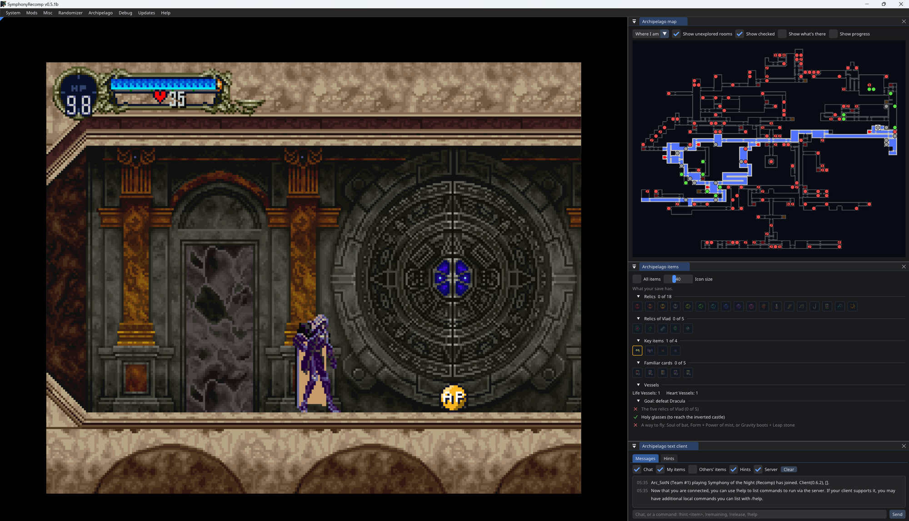

# SotN Archipelago for SymphonyRecomp

Castlevania: Symphony of the Night for [Archipelago](https://archipelago.gg), running on
[SymphonyRecomp](https://github.com/BlackLabelHQ/SymphonyRecomp) instead of BizHawk. No emulator, and your disc
doesn't get patched. The mod sets up your seed while the game runs.

It's based on fdelduque's SotN apworld, so the items, locations and logic are the same.

This is still a test build, so expect some bugs. If you find one, please open an [issue](../../issues).

## Requirements

- SymphonyRecomp v0.5.1b or newer, set up with your own US disc image (SLUS-00067)
- Archipelago 0.6.0 or newer
- The files from the [latest release](../../releases/latest)

## Setup

**Mod:** drop `sotn-archipelago-mod.zip` into SymphonyRecomp's `mods` folder (don't unzip it). Start the game,
press F1, open Mods and enable Archipelago. To update, just replace the zip.

**APWorld:** double-click `sotn_recomp.apworld` or install it from the Archipelago Launcher. The game is called
"Symphony of the Night (Recomp)", so it won't conflict with the BizHawk version.

**YAML:** use `Symphony-of-the-Night-Recomp.yaml` from the release, or generate a template from the launcher. All
the options are explained in the file.

## Playing

Press F1, go to Archipelago > Connection, and enter the server, your slot name and the password if there is one.
After that it reconnects on its own when you start the game. Passwords aren't saved, so password rooms need a
manual connect.

Then start a new game or load your save. Each save is tied to its seed and the mod keeps a copy of the seed on
your PC, so you can keep playing offline. Everything syncs when you reconnect.

The goal is beating Dracula.

## AP items

Items for other players show up as AP badges, colored by how important they are:

| | |
|:-:|---|
|  | **Progression**: someone needs it to progress |
|  | **Useful**: helpful, but not required |
|  | **Filler**: money, consumables, etc. |
|  | **Trap** |

Picking one up sends it to its owner. Your own items look like normal items.

## In-game windows

Everything is under the Archipelago menu (F1), and the Connection window has buttons for the rest.

- **Map**: your locations on the castle map. Green is reachable now, red is blocked, grey is checked. Hover for
  names.
- **Items**: an item tracker with a checklist for the goal.
- **Text client**: chat, hints and commands like `!hint`.

The [SotN PopTracker pack](https://github.com/Michpem/SOTN-AP-MapTracker) also works.

## Compared to the BizHawk version

Both versions use the same items, locations and logic, and the PopTracker pack works with either. If you play on
BizHawk, fdelduque's version is the one to use. This one is for playing on SymphonyRecomp, and it adds a few
things along the way:

- Everything runs inside the recomp, with no separate client
- AP items are shown as colored badges
- A built-in map, item tracker and text client
- Offline play, with saves tied to their seed
- Reworded option names and some fixes (see the [changelog](CHANGELOG.md))

## What the mod changes

The mod only connects to the Archipelago server you enter. It keeps your last 10 seeds in `archipelago-seeds` in
the game folder, stores its settings in the recomp's `interface.ini`, and uses a few unused bytes in your save
(which seed it belongs to and how many items you've received). It also turns off the recomp's built-in
randomizer while you're playing an AP seed. More detail in [how it works](docs/how-it-works.md).

## Troubleshooting

- If Archipelago isn't in the menu bar, check the Mods window. A red mark means it failed to build, and the console
  will say why.
- "InvalidGame" when connecting means the seed was made with the BizHawk apworld.
- For anything else, copy the log from the Connection window and open an issue. Please don't report bugs with this
  mod to SymphonyRecomp.

## Development

`mod/` is the mod (C#, compiled by the game), `apworld/sotn_recomp/` is the apworld, and `tools/` has the build
scripts and offline tests. See [TESTING.md](TESTING.md) and [how it works](docs/how-it-works.md).

## Credits

- fdelduque for the original SotN apworld, and Darvitz for the item and location groups
- BlackLabelHQ for SymphonyRecomp, and MottZilla and eldri7ch for its randomizer support
- Wild Mouse (sotn.io), MottZilla, eldri7ch, TalicZealot, Forat Negre, CRAZY4BLADES and the sotn-decomp
  contributors for the randomizer research all of this builds on
- Michpem and DorkmasterFlek for the PopTracker pack
- The Archipelago team

Made by Arcadia64 with help from Claude.

## License

MIT (the apworld keeps Archipelago's MIT license). No game data is included; you need your own copy of the game.
Not affiliated with Konami, BlackLabelHQ or Archipelago.
